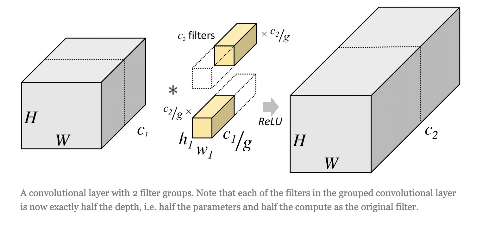
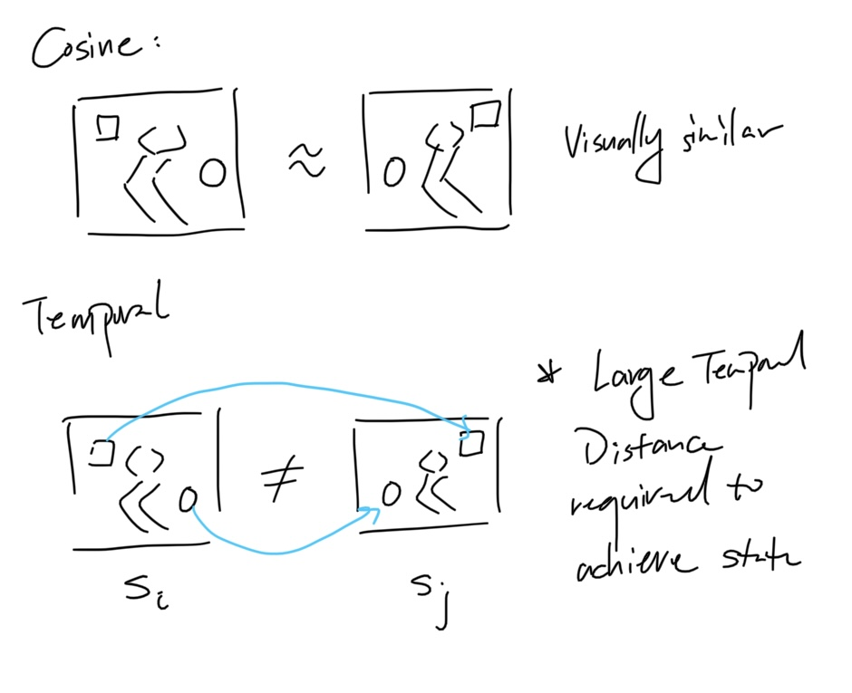

# Reading Summaries
Compression is learning 🥸

## Multi-Game Decision Transformers

- 

## [Decision Transformer: Reinforcement Learning via Sequence Modeling](https://proceedings.neurips.cc/paper/2021/file/7f489f642a0ddb10272b5c31057f0663-Paper.pdf)

- `"The core idea is to let transformers model trajectories ... a sequence of returns, states and actions. Interestingly, only predicting actions is found to be necessary (as opposed to predicting other tokens of states and returns as well). Modelling the full trajectory could be a nice direction for future work: something like predicting discretized embeddings of states using a VQ-VAE could work well"`

- Summary: Authors propose new paradigm for reinforcement learning, where MDP is reframed as a sequence modeling problem. Trajectories are represented as sequences of states, actions and returns. The transformer architecture is used to output actions based on input trajectories. Performance can be tuned by simply asking for specific task returns. 
- Advantage over behavior cloning: Decision transformer performs on par with behavior cloning, but outperforms it in low data regimes where DT uses all trajectories to generalize. 
- Illustrative example on shortest path as RL task: DT can learn from random walks on the graph by stitching together trajectories after conditioned with high return. 

## [Independently Controllable Factors](https://arxiv.org/pdf/1708.01289.pdf)

## [World Models](https://arxiv.org/pdf/1803.10122.pdf)

- Summary: Biological Agents develop mental models of the world to complete tasks instinctively by predicting future senses given the current state and action. Large neural models are ideal for world modeling, but it is limited in traditional RL approaches due to the credit assignment problem. This paper attempts to circumvent the problem by first training a large world model via unsupervised learning and then using the model to train a small controller on the latent space. The authors later showed that the controller can be directly trained on the hallucinated latent space and transfered to the real task, but adding uncertainty is important to prevent world model exploitation. One potential issue with this approach is the world model is only as good as the states it explores. Thus, for more complicated models, a iterative training scheme is required to improve the world model. Curiosity can be instilled into the model by flipping the model model loss during exploration. Further, the authors propose using world models to predict future actions and rewards, which has the effect of absorbing complex control policies into the large world model, which allows the smaller controller to focus on high level actions.
- 
- Thoughts: model is relatively small - how well does it scale? VAE captures irrelevant information like the texture on walls- how to prune? It there a way to train world models hierarchically? Neuroscience literature suggest learned memory can be consolidated into long & short term memory, how to incorporate this into the model? Can "foundation models" be used to bootstrap the encoder / world model?

## [Learning Affordance Landscapes for Interaction Exploration in 3D Environments](https://arxiv.org/pdf/2008.09241.pdf)

- Summary: 

- Thoughts: Does the agent need to explore everytime it goes into a new env? or is zero-shot inference possible? It sounds like the affordances are attached to a particular environment, but is it possible to learn a general model of affordances?

## [Designing Network Design Spaces (RegNets)](https://arxiv.org/pdf/2003.13678.pdf)

- 2022/10/9

- Design space: Parameterized set of possible network architectures

- Designing design spaces: finding good parameterizations for network populations.

- Difference from neural architecture search: Finding populations instead of a particular model instance

- Approach: Progressively simplify a initial unconstrained design space, discovering general design principles that yield better models. Models can be sampled from design spaces, giving rise to model distributions within the space

- Quantifying design space quality: Sampling models from space and create distribution of model errors
  - Error empirical distribution function (EDF): 
    - $F(e) = \frac{1}{n}\sum_{i=1}^{n}{1[e_i < e]}$
    - $F(e)$ is fraction of models in population with error less than $e$

  - Finding good parameters: Create 1D projections of EDF on the parameter space. (eg. depth vs error) and estimate best network properties based on empirical bootstrap

  - Improving design space: find useful insights from statistical analysis

- AnyNet design space
  - Simple stem and head, focus on body structure
  - DoF: for `Stage_i`, have depth, block width, & group size (se group convolution)`(d_i, w_i, g_i)`
    - group convolution: divide filters into g groups, each only applying convolution to corresponding filter group in the input.
  
  - AnyNetX: Use standard block wth 1x1 bottleneck, 3x3 convolution, residual connections

  ```python
  AnyNet
    Stem
      in-> 3, r, r image
      return-> w_0, r/2, r/2
    Body
      Stage_1
      ...
      Stage_i
        in-> w_i-1, 2r_i, 2r_i
        Block
        Block
        Block
        ...
        Block_d_i
        return-> w_i,r_i,r_i
      ...
      Stage_4
    Head
      FC return-> n_outputclasses, 1, 1
  ```
  - AnyNetXA-E: Start from basic design space, discover principles to improve space.
    - AnyNetXB: **Shared bottleneck ratio across stages**. EDF stays same, vastly simplifies design space
    - AnyNetXC: **Shared group width**
    - AnyNetXD: Examine network structures of AnyNetC. Insight: **Good networks have increasing widths** (number of filters)
      - Add constraint: $w_{i+1} \geq w_{i}$
    - AnyNetXE: **Enforce similar constraint on state depth**: $d_{i+1} \geq d_{i}$

  - RegNetX design space: Combine insights from AnyNet into quantized network design space parameterization
    - Plotting aggregate best model depth_idx vs. width: find behavior described by linear fit: $w_j = 48 (j+1)$
    - But need to quantize line to piecewise linear function
      - 1. $u_j = w_o + w_a j$
      - 2. $u_j$ quantization: Find $s_j$ st $u_j = w_o w^{s_j}_m$
      - 3. $w_j = w_0 w^{\mathbf{round}(s_j)}_m$
      - **Q: Why cannot round $u_j$ directly?**

- Thoughts: Promising network design methodology applied to image classification. How can this be applied to other architectures to optimize design space?
  
## [Do As I Can, Not As I Say: Grounding Language in Robotic Affordances](https://arxiv.org/pdf/2204.01691.pdf)

- Summary:

## [What Can I Do Here? Learning New Skills by Imagining Visual Affordances](https://arxiv.org/pdf/2106.00671.pdf)

## [Discovering and Achieving Goals via World Models](https://arxiv.org/pdf/2110.09514.pdf)

- 2022/10/8
- Overcome exploration problem in unsupervised RL
- Train explorer and achiever policies. Explorer acts upon imagined states from the world model to discover interesting states. New discovered states are used to trained the achiever policy to reach new states reliably. 

  **Algorithm**: Latent Explorer Achiever (LEXA)
  ```
  initialize:
    world model M, 
    replay buffer D, 
    temporal distance function d,
    explorer pi_e(a_t|z_t), achiever pi_a(a_t|z_t, g)

  while exploring do:
    train M on D
    train pi_e on imagination of M to maximize exploration reward
    train pi_a on z_t, g to maximize goal reward
    train temporal distance function d on z_i, z_j
    deploy pi_e and pi_a to collect data

  while evaluating do:
    deploy pi_a to reach goal g
  ```

- World model
  - Uses Recurrent State Space model, 4 components:

    1. Encoder: $e_t = enc_{\phi}(x_t)$, takes in current frame and outputs an encoding
    2. Dynamics: $p_{\phi}(s_t | s_{t-1}, a_t)$, predicts future state based on current state and action
    3. Posterior: $q_{\phi}(s_t | s_{t-1}, a_t, e_t)$, predicts future state based on current state, action **and encoding**
    4. Decoder: $d_{\phi}(x_t | s_t)$, predicts next frame based on current state
  - Encoding $e_t$ vs state $s_t$: encoding is a representation of the current frame, while state is a internal representation of the current state of the world. $s_t$ contains deterministic component $h_t$ modeled by a GRU, plus a stochastic component $z_t$ modeled by a diagonal covariance Gaussian distribution.
  - Why need posterior? - Add new information to the state representation.

- Explorer
  - Key idea: world model can be used to imagine future states.
  - Explorer can exploit this and actively seek out new and surprising states imagined by the world model.
  - How to measure uncertainty? Authors train separate model ensembles in parallel with world model. The uncertainty is measured by the variance of the ensemble predictions.
  - Explorer agent seeks to maximize the uncertainty of the world model via exploration reward $r_e$.

- Achiever
  - Train in world model imagination with policy conditioned on current model state and goal image encoding. 
  - Maximize unsupervised goal reaching reward
  - Reward function choices: 
    - Simple: cosine similarity between goal image and current frame in latent space
    - Problem: naive approach overemphasizes visual similarity, agent can choose to ignore factors in image that are not directly controllable (ie objects) and match only robot position.
    - Solution: Temporal distance: train network $d$ to predict time steps between states, use state embeddings as input.
    - Temporal distance training requires including samples where state pairs are from different episodes. (return max time)
    - Temporal distance reward function: $r^g_t(s_t, e_g) = -d_{\omega}(\hat{e}_t, e_g)$ (higher the temporal distance, lower the reward)
    - Intuition for fix: robot states can be quickly achieved and therfore ignored
    

## [Dense Unsupervised Learning for Video Segmentation](https://proceedings.neurips.cc/paper/2021/file/d516b13671a4179d9b7b458a6ebdeb92-Paper.pdf)

- 2022/10/8
- Four Assumptions:
  - 1. Non-local feature diversity: More distant the visual features, the more likely they are different semantic entities.
  - 2. Temporal coherence: Feature vectors from one frame should be close to features from another close frame in the embedding space
  - 3. Temporal persistence of semantic content: Semantic content of temporally close frames can be represented by the same feature set.
  - 4. Equivariance to similarity transformations: Feature embeddings should be invariant to similarity transformations.

- Approach:
  - Self-supervised loss to impose the 4 assumptions
  - 1. Learn Dense spatially discriminitive features
  - 2. Learn to distintuish dense features of different video sequences
  - 3. Learn to represent all frames in sequence as a composite of dense features from a single frame
  - 4. Learn features equivariant to similarity transformations
  - Impose loss on these assumptions

- Loss functions
  - For each video segment, sample random frame, overlay grid and compute anchor features.
  - For rest of frames, compute affinity of feature k to anchor q
  - Self-training loss: cross entropy of `similarity_transform(affinity of feature k_i to k_u_i)`, where u_i is the argmax over affinities in the regularization branch
  - Cross-view loss: Sample features on grid, compute cross entropy of cosine similarity of features.

- Thoughts: The assumptions made in this paper makes sense. Objects in the world should be spatially and temporally consistent. However the approach is less than intuitive - it is not immediately clear how the self training loss contributes to satisfying the assumptions. Wonder if there is a object-centric approach to this problem instead of relying on grid sampling.

## [Curiosity-driven Exploration by Self-supervised Prediction](https://pathak22.github.io/noreward-rl/resources/icml17.pdf)

- Intrinsic curiosity: self-supervised rewards as error between predicted and actual next state for a given action
- Intrinsic curiosity module (ICM): ICM takes in action $a_t$, states $s_t$, $s_{t+1}$. It has two heads: inverse dynamics model and forward model, which predicts action $\hat{a}_t$ and the next state feature vector $\hat{\phi}(s_{t+1})$

  - In the inverse dynamics model, $s_t$ and $s_{t+1}$ is used to predict the action taken by the agent. The states are fist embedded into feature vector $\phi$ before passed to the model. This ensures only relevant features are encoded and the system is robust to noise.
  - The forward model predicts next state feature vector $\hat{\phi}(s_{t+1})$ based on the current action $a_t$ and the current state embedding $\hat{\phi}(s_{t})$. **Therefore, more unknown current state & action pairs leads to higher prediction error and a larger intrinsic reward**
  - ICM intrinsic reward $r_t^i$ is the difference between predicted next state feature and actual next state feature. $\hat{\phi}(s_{t+1})$ - ${\phi}(s_{t+1})$
  - What is the purpose of the inverse dynamics model if it is not used? A: Need it to learn efficient and robust representation of state. Curiosity on pixels alone is subject to noise.
  - **Why not just use an autoencoder??** Only state changes due to the agent's action should be represented

- How ICM interacts with policy: ICM provides the intrinsic reward $r_t^i$, and the policy $\pi$ maximizes the sum of extrinsic and extrinsic rewards.

- IC drawback? see [deepmind blog](https://www.deepmind.com/publications/is-curiosity-all-you-need-on-the-utility-of-emergent-behaviours-from-curious-exploration) Skills learning during curiosity training can be overwritten because of diminishing rewards. Propose hierarchical training with explicit skill retention?

## [SCALING LAWS FOR A MULTI-AGENT REINFORCE- MENT LEARNING MODEL](https://arxiv.org/pdf/2210.00849.pdf)

- 2021/10/10
- Summary: Use MARL algorithm (AlphaZero) to uncover power scaling laws
  - Performance scales with parameter count when not bottlenecked by compute
    - Q: Why not just train the model longer?
    - A: Compute is calculated by $C = STFD$, where S is number of steps, T is number of simulations per move, F is cost of neural net forward pass, D is amount of datapoints needed to trigger optimization step.
    - So Compute includes training time
  - Performance scales with available compute when training optimally sized agents
  - Previously SOTA models are smaller than optimal
- The pareto front: Agents with max elo with similar or less compute.
  - Insight: Agents reach pareto front before converging (Fig 4) - should get bigger model instead of training longer?

- Sample efficiency:
  - Large models perform better than smaller ones given the same amount of data
  - ? Under fixed compute and unconstrained data, large models need more data to reach pareto front

## [Spatial Broadcast Decoder](https://arxiv.org/pdf/1901.07017.pdf)

## [Planning with Diffusion for Flexible Behavior Synthesis](https://arxiv.org/pdf/2205.09991.pdf)

- 2021/10/13

- Common approaches in model-based RL uses a world model separate from the trajectory optimizer / planner. Often times, planners that utilize world models exploit modeling deficiencies, leading to control policies that behave like adversarial samples. This paper proposes to create a diffusion based planner that directly optimizes the trajectory. In this modality, planning is equivalent to sampling from the diffusion process.


## [Learning Transferable Visual Models From Natural Language Supervision (CLIP)](https://arxiv.org/pdf/2103.00020.pdf)

- Related: https://arxiv.org/pdf/2002.05709.pdf

## [Generalization with Lossy Affordances: Leveraging Broad Offline Data for Learning Visuomotor Tasks](https://arxiv.org/pdf/2210.06601.pdf)

- 2022/12/24
- Offline data can be used to train affordance models $m(z'|z,u)$, where u is a learned latent code representing transition from z to z'. An optimal plan is generated be recursively sampling the affordance model and choosing the best path via MPPI.
- First train offline RL to learn policy, value function, Q function via learned latents. The affordance model training objective is $D_{KL}(p_m(z'|z) || \phi(z'|s'))$ where $\phi(z'|s')$ is the encoding of the next state $s'$, and $p_m(z'|z)$ is the marginal distribution of the affordance model. Transition encoding $u$ can be learned under a conditional variational autoencoder framework. 
- During fine-tuning, the policy, value function, Q function are trained with latent distances acting as the reward.

## [Forward-backward Reinforcement Learning](https://arxiv.org/pdf/1803.10227.pdf)

- 2022/12/26
- Use imagined and real experiences to learn values
- (in addition to learning from forward steps, also learn values from imagined backward steps)

## [Robust imitation of a few demonstrations with a backwards model](https://arxiv.org/pdf/2210.09337.pdf)

## [You Only Live Once: Single-Life Reinforcement Learning](https://arxiv.org/pdf/2210.08863.pdf)

## [Autonomous Reinforcement Learning via Subgoal Curricula](https://arxiv.org/pdf/2107.12931.pdf)

## [Learning the Arrow of Time for Problems in Reinforcement Learning](https://openreview.net/pdf?id=rylJkpEtwS)

## [EPISODIC CURIOSITY THROUGH REACHABILITY](https://arxiv.org/pdf/1810.02274.pdf)

- convert envs from sparse to dense rewards by adding a reachability reward

## [Dynamics-Aware Unsupervised Discovery of Skills](https://arxiv.org/pdf/1907.01657.pdf) 

- 2022/11/26

- Motivation is the maximization of conditional mutual information $I(s';z|s) = H(s'|s) - H(s'|z,s)$, which makes the agent maximize state diversity and also make current skill more informative about future states.
- First train agent on intrinsic reward by jointly training intrinsic reward and policy. Then apply to environments using MPC via the learned skill-dynamics.

## [Random Network Distillation]()

- 2022/11/27

- Another instance of tyring to solve the static TV problem. Propose a fixed random network and a parallel predictor network. Intrinsic reward calculated by the difference between the two outputs. As the predictor get better at predicting the random network, the intrinsic reward decreases. This removes the rependency on next state prediction, thus fixing the static TV problem.

## [Never Give Up: Learning Directed Exploration Strategies](https://arxiv.org/pdf/2002.06038.pdf)

## [Space is a latent sequence: Structured sequence learning as a unified theory of representation in the hippocampus](https://arxiv.org/pdf/2212.01508.pdf)

- 2022/12/16
- Mental representation of space as a sequence learning problem. Cloned HMMs are used to create separate contexts to disambiguate similar observations from different states. Cloned HMMs can be used to construct a place field.

## [Act2Vec](https://arxiv.org/pdf/1902.01119.pdf)

- 2022/12/16
- Actions that result in similar state transitions should be close in embedding vector space.
- Use action embeddings for state augmentation: SxA^H -> A

- Thoughts: we need 1. longer action horizons, 2. multidimensional actions, 3. complex environments with high state dimensions (use state embeddings as well)
- Actions improve state representation, -> state representation improves action representation? Can they improve each other?

## [Learning Action Representations for Reinforcement Learning](https://arxiv.org/abs/1902.00183)

- 2022/12/16
- Action representation as supervised learning. Aligns actions based on their impacts on the state.
- Internal policy: SxE->[probability], and factorized policy: E->A. Internal policy can be sampled to output embeddings and factorized policy can be used to output actions.

## [Masked Visual Pre-training for Motor Control](https://arxiv.org/pdf/2210.03109.pdf)

- 2022/12/24
- Use real-world datasets to pretrain masked vison transformer. Then use the pre-trained model to learn motor control policies using PPO. Introduced new benchmark (PixMC) on Issac Gym.


## [Training Robots to Evaluate Robots: Example-Based Interactive Reward Functions for Policy Learning](https://arxiv.org/pdf/2212.08961.pdf)

- 2022/12/24
- Interactive reward functions: Some tasks require interaction to verify success. Can this be used to create reward functions for RL? IRF first bootstraps a policy on single observation rewards functions (i.e. image classifiers) to create negative actionable outcome examples. Next the IRF policy is trained on positive and negative samples be maximizing the single observation reward - the policy acts on the final state and determines whether the task was successful. Finally, the IRF reward is used to train a policy on the original task to maximize the IRF reward.

## [Mastering Diverse Domains through World Models (Dreamer-V3)] (https://arxiv.org/pdf/2301.04104v1.pdf)

- 2023/01/12
- Discrete VAE encodes sensory information, Recurrent State Space Model as world model. Train actor critic on imagined states. Use Symlog transformation for reward/value normalization across domains to avoid hyperparameter tuning.

## [Just Go with the Flow: Self-Supervised Scene Flow Estimation](https://just-go-with-the-flow.github.io)

- 2023/01/13
- Two self-supervised losses: Nearest neighbor loss, Cycle consistency loss.
- Nearest neightbor loss: distance between predicted pointcloud and nearest neighbor in ground truth t+1 pointcloud.
  - Problems: potential large errors in prediction, point correspondance uniqueness is not guaranteed, lack of neighbors in sparse pointclouds.
- Cycle consistency loss: Reverse the predicted flow back to original pointcloud at t and compare to ground truth pointcloud at t. Helps avoid degenerate solutions.
- Anchored cycle consistency loss: Problem: predicted flow is noisy. Reversing noisy flow is ill-posed. Solution: Create anchor point from convex combination of predicted flow and its nearest neighbor. Anchor point is used to reverse flow.

## [SLIM: Self-Supervised LiDAR Scene Flow and Motion Segmentation](https://baurst.github.io/slim/)

## [PointPillARS: Fast Encoders for Object Detection from Point Clouds](https://arxiv.org/pdf/1812.05784.pdf)

- 2023/01/15
- 